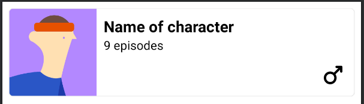

# Underdog Technical Challenge
Given the current skeleton of a project, let's complete the implementation to get something on screen.
I would like you to build a simple scrolling vertical list of characters. You can find information 
on the structure of your data below, along with some other resources that are already included in 
the project.

For the screen, I would like to see a **loading state** (let's assume the data came from
an actual API), then a list of scrolling items that each display character image, name, number of 
episodes, and gender - resources are already imported into the project for MALE and FEMALE characters.
A sample UI you can build can be found below:



## Coil
[Image loading library]: https://coil-kt.github.io/coil/

## Moshi
[JSON (de)serialization library]: https://github.com/square/moshi
```
val moshi = Moshi.Builder().addLast(KotlinJsonAdapterFactory()).build()
```

## JSON Format
Located inside the `../src/main/res/raw` folder, there exists a file named `characters.json`.  This file contains a well formatted JSON object that contains a list of `Character` objects. Each character follows this structure:
```
id: Int (unique)
name: String,
status: String,
species: String,
type: String,
gender: String,
image: String,
origin: Origin(name: String, url: String),
location: Location(name: String, url: String),
episode: List<String>?,
url: String,
created: String (ISO timestamp)
```
